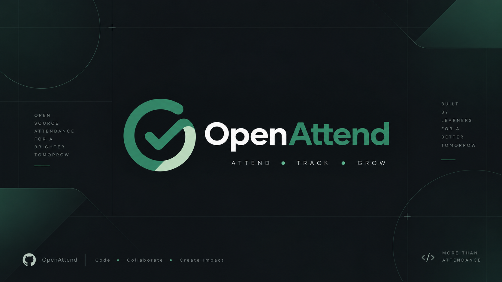
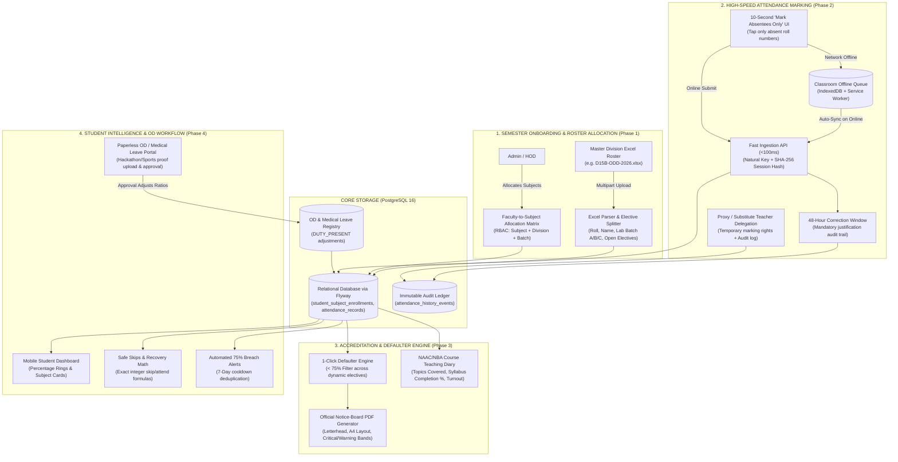

<p align="center">
  <a href="https://github.com/iykyk-vedant/Attandance-ERP-System-VESIT">
    
  </a>
</p>

<p align="center">
  <strong>Next-generation, high-performance attendance & academic ERP platform tailored for educational institutions.</strong><br/>
  10-second absentee marking, offline classroom sync, automated NAAC/NBA teaching diary, 1-click notice-board PDF generation, and mathematical safe-skips prediction.
</p>

<p align="center">
  <a href="docs/PRD.md"><strong>Documentation »</strong></a> •
  <a href="docs/architecture.md"><strong>Architecture »</strong></a> •
  <a href="https://github.com/iykyk-vedant/Attandance-ERP-System-VESIT/issues"><strong>15 Contributor Issues »</strong></a> •
  <a href="https://github.com/iykyk-vedant/Attandance-ERP-System-VESIT/milestones"><strong>4 Milestones »</strong></a> •
  <a href="CONTRIBUTING.md"><strong>Contribute »</strong></a>
</p>

<p align="center">
  <a href="https://github.com/iykyk-vedant/Attandance-ERP-System-VESIT/actions/workflows/ci.yml">
    
  </a>
  <a href="https://www.oracle.com/java/technologies/javase/jdk21-archive-downloads.html">
    
  </a>
  <a href="https://spring.io/projects/spring-boot">
    
  </a>
  <a href="https://www.postgresql.org/">
    
  </a>
  <a href="https://github.com/iykyk-vedant/Attandance-ERP-System-VESIT/blob/main/LICENSE">
    
  </a>
  <a href="https://github.com/iykyk-vedant/Attandance-ERP-System-VESIT/issues?q=is%3Aopen+is%3Aissue+label%3A%22good+first+issue%22">
    
  </a>
</p>

---

## 💡 Why OpenAttend?

Traditional college ERP systems are clunky, slow, and despised by both faculty and students. Teachers are forced into tedious 75-checkbox marking forms that waste lecture time, while students have no visibility into whether they are crossing the 75% defaulter threshold.

**OpenAttend** re-architects campus attendance around real engineering college workflows:

| Workflow | Legacy Campus ERP | OpenAttend Architecture |
|---|---|---|
| **Lecture Attendance Speed** | 5+ minutes clicking 75 checkboxes | **< 10 seconds** via **"Mark Absentees Only"** mode |
| **Classroom Connectivity** | Fails completely in basement labs without Wi-Fi | **Classroom Offline Mode** (IndexedDB + Auto-Sync) |
| **Attendance Mistakes** | Lost in silent overwrites or physical letters | **48-Hour Correction Window** with mandatory audit justification |
| **Accreditation Compliance** | Teachers hand-write physical diary registers | **Automated NAAC/NBA Course Teaching Diary** & syllabus tracker |
| **Defaulter Compilation** | Hours of cross-spreadsheet calculations | **1-Click Official Notice-Board PDF** with HOD signature blocks |
| **Official Duty (OD) / Leave** | Students run across campus with paper letters | **Paperless OD Portal** with proof upload & `DUTY_PRESENT` credit |
| **Student Bunk Anxiety** | Blind guesswork before exam blackout | **Real-Time Safe Skips Math** & automated breach notifications |

---

## 🏛 System Architecture & The 4 Operational Pillars

OpenAttend is structured into four interconnected modules designed for high availability, zero duplicate writes, and offline resiliency:



---

### Pillar Breakdown

#### 1. Semester Onboarding & Roster Setup *(Phase 1)*
- **Master Excel/CSV Parser (`#1`):** Imports divisional spreadsheets, maps student roll numbers, allocates lab batches (`A`, `B`, `C`), and splits Open Electives (e.g. Cloud Computing, ADMT, Soft Computing).
- **Faculty Allocation & RBAC Matrix (`#2`):** Secures marking endpoints. Teachers can only view and mark attendance for their designated `Subject + Division + Batch`.
- **One-Command Dev Environment (`#15`):** Docker Compose boots PostgreSQL with pre-seeded sample data in 10 seconds.

#### 2. High-Speed Marking & Classroom Offline Sync *(Phase 2)*
- **10-Second "Mark Absentees" UI (`#3`):** Since $90\%+$ of students are present, teachers don't mark 75 individual checkboxes — they only tap the 2–4 absent roll numbers.
- **Fast Idempotent Submission API (`#4`):** Natural key `(student, subject, date, session)` with SHA-256 session hashing ensures zero duplicate rows on double-taps.
- **48-Hour Correction Window (`#5`):** Teachers can correct marking mistakes within 48 hours by providing a mandatory reason ($\ge 10$ characters), creating an immutable audit trail.
- **Proxy / Substitute Teacher Delegation (`#13`):** Allows delegating lecture slots to colleagues with full authorization tracking.
- **Offline Classroom Sync (`#14`):** Operates seamlessly in basement labs with spotty reception; caches submissions into browser `IndexedDB` and auto-submits once online.

#### 3. Accreditation & Institutional Reporting *(Phase 3)*
- **1-Click Defaulter List Generator (`#6`):** Fast SQL aggregation across dynamic elective rosters to produce instant Excel/CSV defaulter lists.
- **Official Notice-Board PDF Generator (`#7`):** Institutional A4 printable document with college letterhead, department titles, color-coded risk bands (Critical $<65\%$, Warning $65-74.9\%$, Safe $\ge 75\%$), and signature blocks.
- **NAAC/NBA Course Teaching Diary (`#8`):** Logs "Topics Covered" with every lecture and computes syllabus completion percentage metrics.

#### 4. Student Transparency & Paperless OD *(Phase 4)*
- **Mobile-First Student PWA (`#9`):** Live percentage rings and subject cards with sub-50ms load times.
- **Safe Skips & Recovery Math Engine (`#10`):** Verified mathematical projections:
  - $\text{Safe Skips} = \lfloor (4A - 3T) / 3 \rfloor$
  - $\text{Must Attend} = \lceil 3T - 4A \rceil$
- **Automated Defaulter Warning Notifications (`#11`):** Instant email alert on threshold breach, throttled to a 7-day cooldown to prevent spam.
- **Paperless Official Duty (OD) & Medical Leave Portal (`#12`):** Students upload event/medical proof; coordinators approve with 1 click, automatically granting `DUTY_PRESENT` credit.

---

## 🎯 Structured Contributor Roadmap (15 Issues)

OpenAttend is actively maintained with **15 open issues** ready for contributors:

| # | Task | Milestone | Area | Difficulty |
|:---:|---|:---:|:---:|:---:|
| **#1** | [Master Semester Excel Roster Upload & Parser](https://github.com/iykyk-vedant/Attandance-ERP-System-VESIT/issues/1) | Phase 1 | `backend` | 🟢 Beginner |
| **#2** | [Faculty-to-Subject & Batch Allocation API](https://github.com/iykyk-vedant/Attandance-ERP-System-VESIT/issues/2) | Phase 1 | `backend` | 🟡 Intermediate |
| **#3** | [High-Speed Attendance Marking UI (Absentees Mode)](https://github.com/iykyk-vedant/Attandance-ERP-System-VESIT/issues/3) | Phase 2 | `frontend` | 🟡 Intermediate |
| **#4** | [Fast Attendance Submission API with Idempotency](https://github.com/iykyk-vedant/Attandance-ERP-System-VESIT/issues/4) | Phase 2 | `backend` | 🟡 Intermediate |
| **#5** | [48-Hour Attendance Correction Window & Audit](https://github.com/iykyk-vedant/Attandance-ERP-System-VESIT/issues/5) | Phase 2 | `backend` | 🟢 Beginner |
| **#6** | [1-Click Defaulter List Generator (Excel/CSV)](https://github.com/iykyk-vedant/Attandance-ERP-System-VESIT/issues/6) | Phase 3 | `reporting` | 🟡 Intermediate |
| **#7** | [Official Notice-Board Ready Defaulter PDF](https://github.com/iykyk-vedant/Attandance-ERP-System-VESIT/issues/7) | Phase 3 | `frontend` | 🟢 Beginner |
| **#8** | [NAAC/NBA Course Teaching Diary ("Topics Covered")](https://github.com/iykyk-vedant/Attandance-ERP-System-VESIT/issues/8) | Phase 3 | `backend` | 🟢 Beginner |
| **#9** | [Mobile-First Student Dashboard & Percentage Rings](https://github.com/iykyk-vedant/Attandance-ERP-System-VESIT/issues/9) | Phase 4 | `frontend` | 🟡 Intermediate |
| **#10** | [Safe Skips & Attendance Recovery Calculator](https://github.com/iykyk-vedant/Attandance-ERP-System-VESIT/issues/10) | Phase 4 | `core-logic` | 🟢 Beginner |
| **#11** | [Automated 75% Attendance Warning Notifications](https://github.com/iykyk-vedant/Attandance-ERP-System-VESIT/issues/11) | Phase 4 | `backend` | 🟡 Intermediate |
| **#12** | [Paperless Official Duty (OD) & Medical Leave Portal](https://github.com/iykyk-vedant/Attandance-ERP-System-VESIT/issues/12) | Phase 4 | `fullstack` | 🔴 Advanced |
| **#13** | [Proxy / Substitute Lecture Delegation & Audit](https://github.com/iykyk-vedant/Attandance-ERP-System-VESIT/issues/13) | Phase 4 | `backend` | 🟡 Intermediate |
| **#14** | [Offline Classroom Attendance Caching with Auto-Sync](https://github.com/iykyk-vedant/Attandance-ERP-System-VESIT/issues/14) | Phase 2 | `pwa` | 🔴 Advanced |
| **#15** | [One-Command Docker Compose & Sample Excel Seeding](https://github.com/iykyk-vedant/Attandance-ERP-System-VESIT/issues/15) | Phase 1 | `devops` | 🟢 Beginner |

👉 **[Browse All Issues on GitHub](https://github.com/iykyk-vedant/Attandance-ERP-System-VESIT/issues)**

---

## 🚀 Quick Start (Local Setup)

### Option 1: One-Command Docker Compose (Recommended)

```bash
# 1. Clone the repository
git clone https://github.com/iykyk-vedant/Attandance-ERP-System-VESIT.git
cd Attandance-ERP-System-VESIT

# 2. Spin up PostgreSQL & Backend
docker compose up -d
```

Open **[http://localhost:8080](http://localhost:8080)** in your browser.

---

### Option 2: Native Development (Java 21 + Maven)

**Prerequisites:**
- [Java 21 LTS](https://adoptium.net/) (`java -version`)
- [Apache Maven 3.9+](https://maven.apache.org/) (`mvn -version`)
- [Docker](https://www.docker.com/) (for PostgreSQL)

```bash
# 1. Start PostgreSQL
docker compose up -d postgres

# 2. Run Spring Boot
cd backend
mvn spring-boot:run
```

---

## 🧪 Automated Testing Suite

OpenAttend enforces automated testing across every milestone:

```bash
cd backend
mvn clean test
```

```text
[INFO] Results:
[INFO] Tests run: 35, Failures: 0, Errors: 0, Skipped: 0
[INFO] BUILD SUCCESS
```

---

## 📄 Documentation

- [**System Architecture & Data Flows**](docs/architecture.md)
- [**Product Requirements Document (PRD)**](docs/PRD.md)
- [**Frontend Design Tokens & UI Specs**](docs/UI.md)
- [**Milestone Roadmap (M0–M9)**](docs/Milestone.md)
- [**Administrator Setup Guide**](docs/setup-guide.md)
- [**Contributing Guidelines**](CONTRIBUTING.md)

---

<p align="center">
  
  <br/><br/>
  <sub>OpenAttend is an open-source academic initiative built for VESIT. Released under the <a href="LICENSE">MIT License</a>.</sub>
</p>
