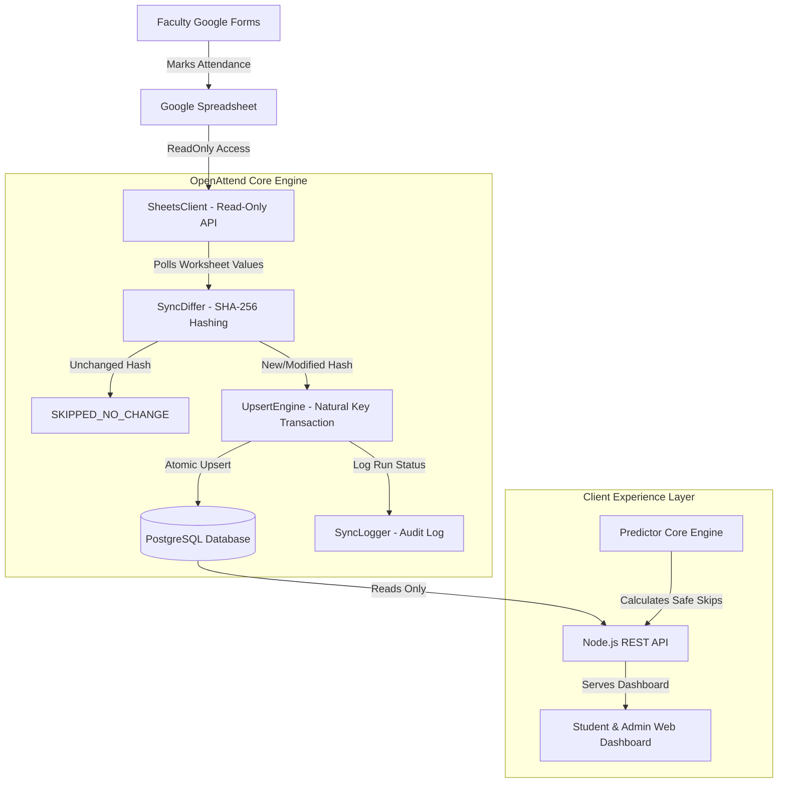
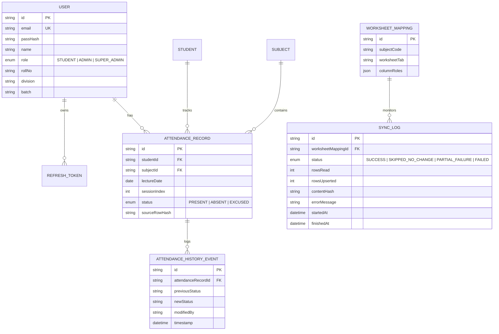

# OpenAttend System Architecture & Database Schema

OpenAttend is an architecture-decoupled, read-only companion attendance platform tailored for educational institutions.

---

## 🏗 System Architecture Diagram

---

## 🗄 Entity-Relationship (ER) Diagram

