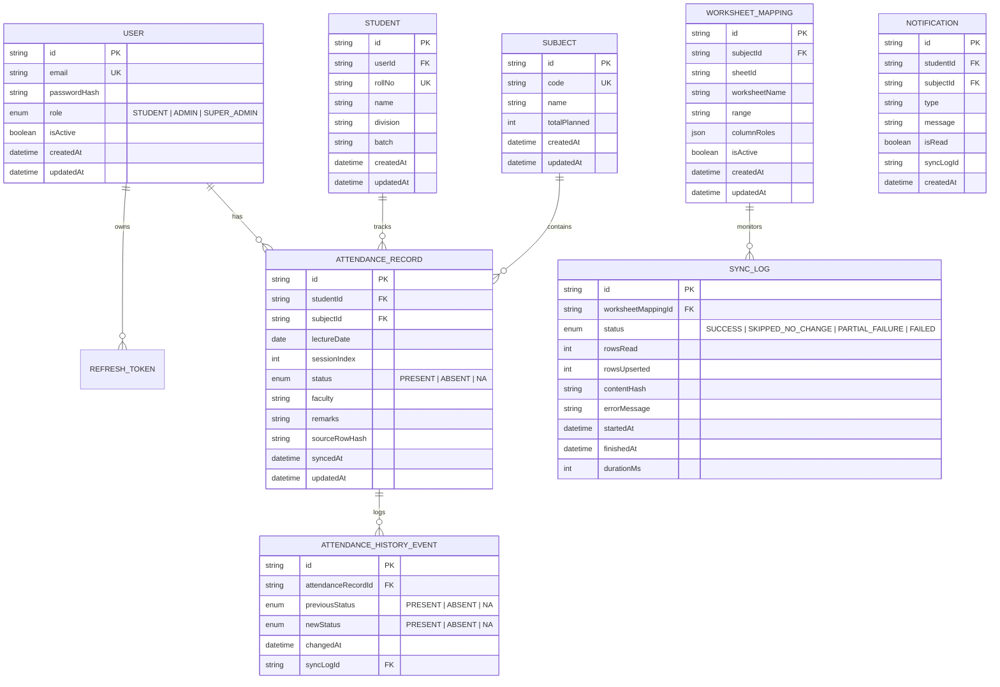

# OpenAttend System Architecture & Database Schema

OpenAttend is an architecture-decoupled, read-only companion attendance platform tailored for educational institutions.

---

## 🏗 System Architecture Diagram

```mermaid
graph TD
    Faculty[Faculty Google Forms] -->|Marks Attendance| GoogleSheet[Google Spreadsheet]
    
    subgraph OpenAttend Core Backend (Java Spring Boot 3)
        SheetsClient[SheetsClient - Google Sheets Java SDK] -->|Polls Worksheet Values| SyncDiffer[SyncDiffer - SHA-256 Hashing]
        SyncDiffer -->|Unchanged Hash| Skip[SKIPPED_NO_CHANGE]
        SyncDiffer -->|New/Modified Hash| UpsertEngine[UpsertEngine - @Transactional JPA Batch]
        UpsertEngine -->|Atomic Upsert| PostgreSQL[(PostgreSQL Database via Flyway)]
        UpsertEngine -->|Log Run Status| SyncLogger[SyncLogger - Audit Log]
        
        Scheduler[Spring TaskScheduler / Cron] -->|Scheduled Polling| SheetsClient
        PredictorCore[PredictorService Engine] -->|Calculates Safe Skips & Projections| RESTApi
        Security[Spring Security 6 + JJWT] -->|Stateless Auth & Domain Filter| RESTApi[Spring Web MVC REST Controllers]
        Actuator[Spring Boot Actuator] -->|Health & Prometheus Metrics| Metrics[/actuator/prometheus]
    end

    GoogleSheet -->|ReadOnly Scoped Access| SheetsClient

    subgraph Client Experience Layer
        PostgreSQL -->|Reads Only| RESTApi
        RESTApi -->|Serves JSON API & Dashboard| WebUI[Student & Admin PWA Dashboard]
    end
```

---

## 🗄 Entity-Relationship (ER) Diagram



---

## 🛡 Architectural Guarantees & Non-Negotiable Invariants

1. **Strict Read-Only Google Sheets Scopes**: No code path anywhere requests Google write permissions (`spreadsheets.readonly` only).
2. **Zero Synchronous External Calls on User Reads**: Student and Admin dashboard reads query PostgreSQL directly; they never call Google Sheets API synchronously.
3. **Natural Key Idempotency**: Attendance records are uniquely identified by `(studentId, subjectId, lectureDate, sessionIndex)`. Repeated sync runs produce zero duplicate rows.
4. **Institutional Security & RBAC**: Strict validation that all authenticating accounts belong to the allowed institutional domain (`@ves.ac.in`).
